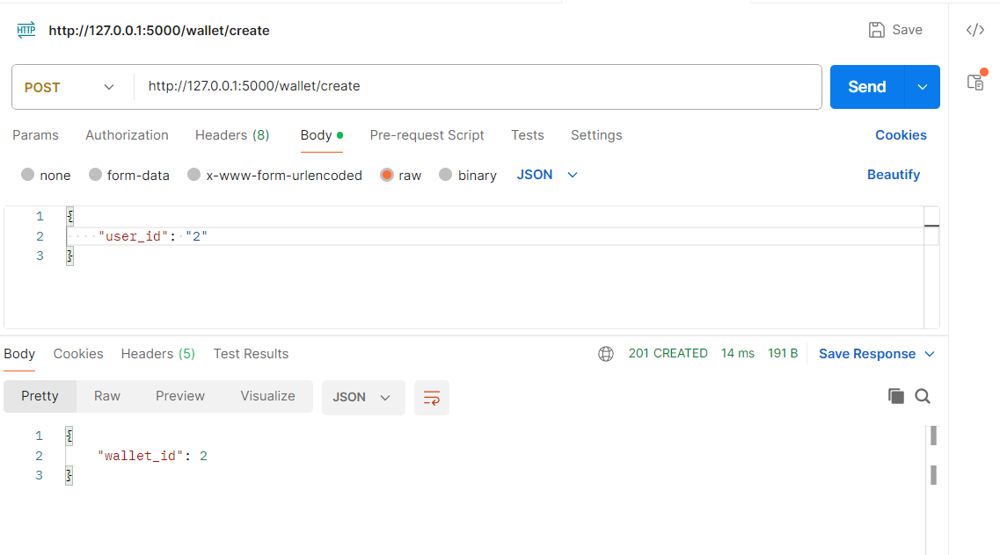
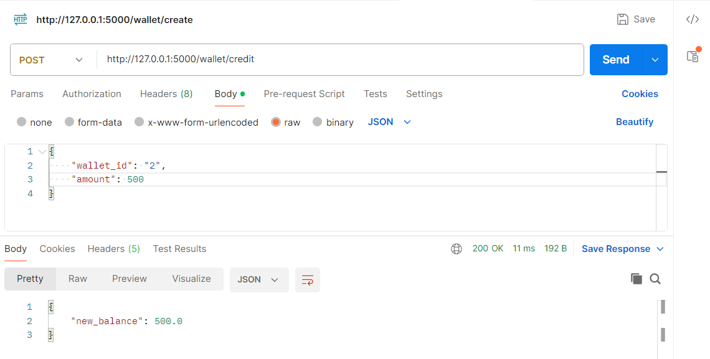
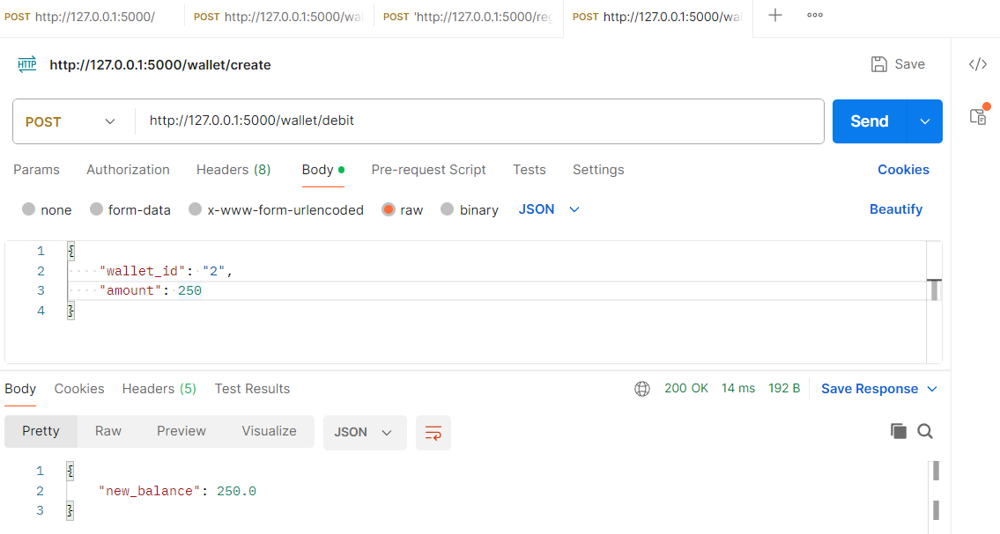
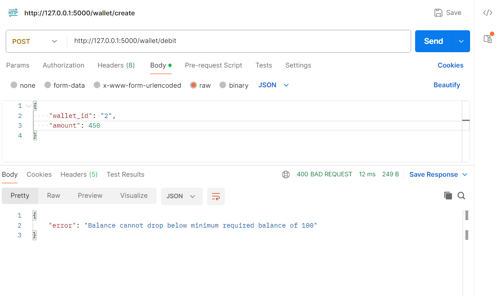
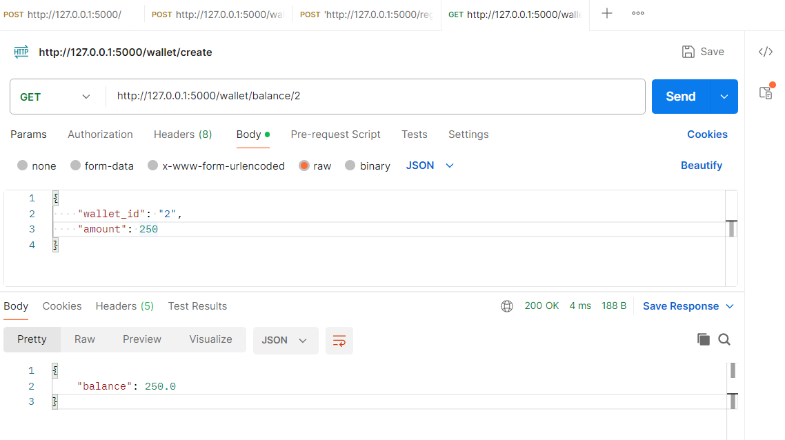
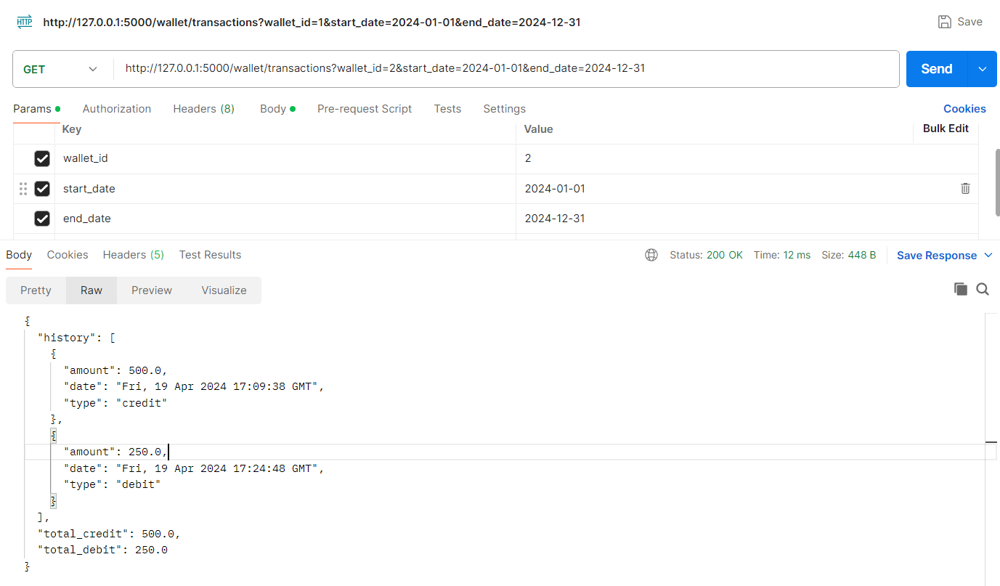

# Asper-Wallet
This is a Flask-based RESTful API for managing wallets and transactions.

### Setup Instructions Local
Follow these steps to set up the project locally:

#### 1. Clone the Repository

Clone the repository to your local machine:

```
git clone https://github.com/your-username/asper-wallet-api.git
```

#### 2. Install Dependencies

Navigate to the project directory and install the required dependencies:

```
pip install -r requirements.txt
```

#### 3. Run the Flask Application

Start the Flask application:
```
flask run
```

## For Docker Image

This is a Flask-based RESTful API for managing wallets and transactions.

### Installation

To run this application locally, you can pull the Docker image from Docker Hub.

[asper-wallet-api:0.0.1.RELEASE](https://hub.docker.com/layers/raghavpatnecha/asper-wallet-api/0.0.1.RELEASE/images/sha256:68fcaf25870528fd5a8d383d97ffca50e1734cd7c96127c1e7c430f1c1c36131?uuid=0D0569DE-529C-4EFC-A178-965362335AF3)

#### 1. Pull the Docker image:
   ```
   docker pull raghavpatnecha/asper-wallet-api:0.0.1.RELEASE
   ```

#### 2. Run the Docker container:
```
docker run -d -p 5000:5000 raghavpatnecha/asper-wallet-api:0.0.1.RELEASE
```


## API Usage

### Endpoints

- **Register a User** - Send a POST request to register a user
```
curl -X POST -H "Content-Type: application/json" -d '{"phone_number": "1234567890"}' http://127.0.0.1:5000/register
```

- **Create Wallet** - Create a wallet for a user
```
curl -X POST -H "Content-Type: application/json" -d '{"user_id": "your_user_id_here"}' http://127.0.0.1:5000/wallet/create
```

- **Credit Money** - Credit money to a wallet.
```
curl -X POST -H "Content-Type: application/json" -d '{"wallet_id": "your_wallet_id_here", "amount": 100}' http://127.0.0.1:5000/wallet/credit
```

- **Debit Money** - Debit money from a wallet. Won't allow debit if insufficient balance and balance below minimum
```
curl -X POST -H "Content-Type: application/json" -d '{"wallet_id": "your_wallet_id_here", "amount": 500}' http://127.0.0.1:5000/wallet/debit
```

- **Get Balance** - Get the balance of a wallet.
 ```
 curl http://127.0.0.1:5000/wallet/balance/your_wallet_id_here
 ```

- **Transaction History** - Get the transaction history of a wallet i.e total debit and total credit for a date range
 ```
 curl http://127.0.0.1:5000/wallet/transactions?wallet_id=your_wallet_id_here&start_date=2024-01-01&end_date=2024-12-31
 ```

## How to Avoid Race Conditions

The application implements measures to avoid race conditions during concurrent debit operations. It includes locking mechanisms with ```with_for_update()``` for effectively locking the row in the database and optimistic locking with `version number` which detects conflicts at commit time to ensure data consistency and integrity. The logic includes a retry mechanism that attempts to debit the wallet up to a specified
number of times (retries) with a delay (delay) between attempts.

### Testing the Race Condition

To test the race condition handling, run the following test case:

```
pytest tests/test_services.py::TestServices::test_race_condition_debit_money
```

### API Screenshots

#### 1. Create Wallet


#### 2. Credit Wallet


#### 3. Debit Wallet


#### 4. Minimum Balance


#### 5. Get Wallet Balance


#### 5. Transaction History



### TODO :
- **Adding Access Tokens and refresh tokens for API Autentication**

  
  

